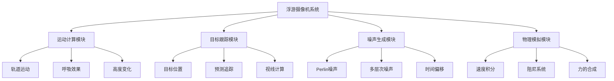
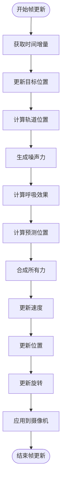
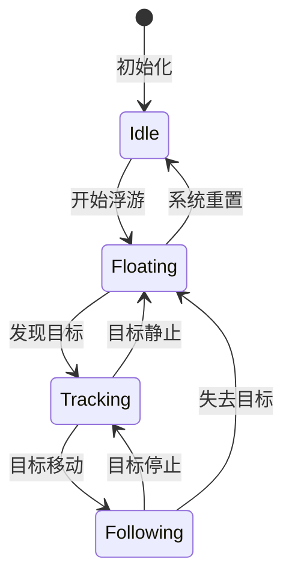
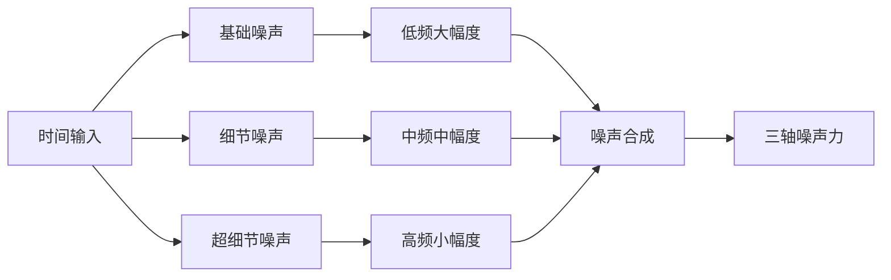
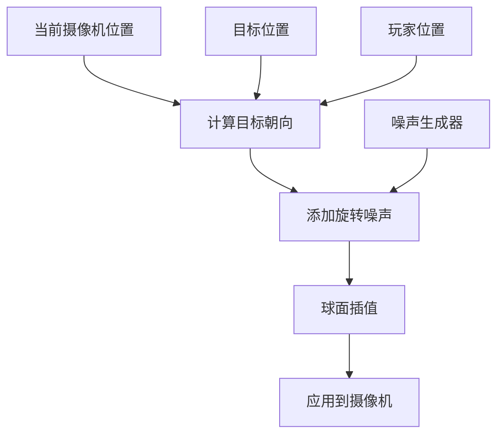
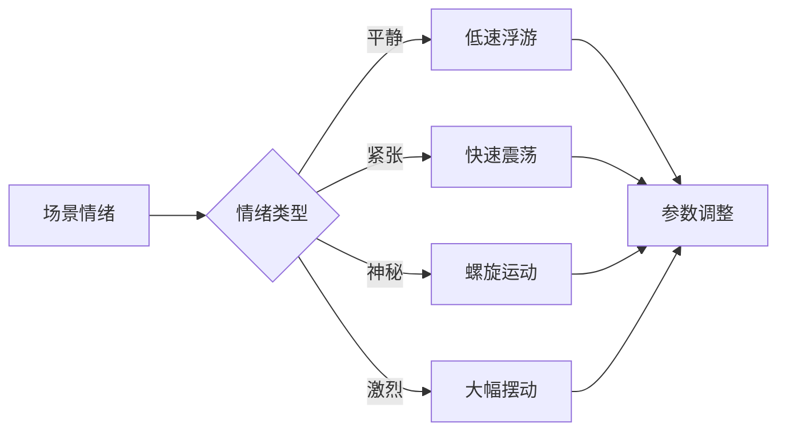

# 浮游视角算法设计文档

## 核心架构



## 算法执行流程



## 核心数学公式

### 1. 轨道运动计算
```
轨道位置 = 目标位置 + 轨道偏移

轨道偏移.x = cos(轨道角度) × 轨道半径
轨道偏移.z = sin(轨道角度) × 轨道半径  
轨道偏移.y = sin(高度角度) × 高度变化幅度 + 基础高度

轨道角度 += 旋转速度 × 时间增量
高度角度 += 旋转速度 × 0.7 × 时间增量
```

### 2. 噪声力生成
```
噪声偏移 += 浮游速度 × 时间增量

噪声力.x = (Perlin(噪声偏移, 0, 0) × 2 - 1) × 浮游强度
噪声力.y = (Perlin(0, 噪声偏移, 0) × 2 - 1) × 浮游强度
噪声力.z = (Perlin(0, 0, 噪声偏移) × 2 - 1) × 浮游强度
```

### 3. 呼吸效果
```
呼吸相位 += 呼吸频率 × 时间增量
呼吸偏移 = sin(呼吸相位) × 0.5
```

### 4. 预测性跟踪
```
IF 目标速度长度 > 0.1 THEN
    预测位置 = 目标位置 + 目标速度 × 预测系数
ELSE
    预测位置 = 目标位置
END IF
```

### 5. 物理模拟
```
目标位置 = 轨道位置 + 噪声力 + 呼吸偏移 + 预测位置

吸引力 = (目标位置 - 当前位置) × 吸引系数
速度 += (吸引力 + 噪声力) × 时间增量
速度 *= 阻尼系数

位置 += 速度 × 时间增量
```

## 参数配置表

| 参数名称 | 建议范围 | 默认值 | 作用描述 |
|----------|----------|---------|----------|
| 浮游强度 | 0.1 - 3.0 | 0.5 | 控制随机漂移的幅度 |
| 浮游速度 | 0.1 - 2.0 | 0.3 | 控制噪声变化的频率 |
| 轨道半径 | 3.0 - 20.0 | 8.0 | 摄像机围绕目标的距离 |
| 高度变化 | 0.0 - 5.0 | 0.8 | 垂直方向的浮动范围 |
| 呼吸频率 | 0.1 - 3.0 | 0.5 | 上下浮动的节奏 |
| 旋转速度 | 0.1 - 1.0 | 0.2 | 轨道旋转的速度 |
| 阻尼系数 | 0.8 - 0.99 | 0.95 | 运动的平滑程度 |
| 吸引系数 | 0.1 - 1.0 | 0.3 | 向目标靠近的力度 |
| 预测系数 | 1.0 - 5.0 | 2.0 | 预测跟踪的前瞻性 |

## 状态机设计



## 噪声生成策略



### 噪声合成公式
```
基础噪声 = Perlin(时间 × 0.5) × 1.0
细节噪声 = Perlin(时间 × 2.0) × 0.5
超细节噪声 = Perlin(时间 × 8.0) × 0.1

最终噪声 = (基础噪声 + 细节噪声 + 超细节噪声) × 浮游强度
```

## 视角平滑算法



### 视角计算公式
```
基础朝向 = 标准化(目标位置 - 摄像机位置)

旋转噪声.x = Perlin(时间 × 0.5, 100, 0) × 0.1
旋转噪声.y = Perlin(时间 × 0.5, 200, 0) × 0.1
旋转噪声.z = Perlin(时间 × 0.5, 300, 0) × 0.1

最终朝向 = 基础朝向 + 旋转噪声
摄像机朝向 = 球面插值(当前朝向, 最终朝向, 插值系数)
```

## 性能优化建议

### 计算优化
- 使用查找表缓存三角函数计算
- 预计算噪声纹理，避免实时生成
- 距离LOD：远距离时降低计算精度

### 内存优化
- 复用向量对象，避免频繁创建
- 使用对象池管理临时计算变量
- 批量处理多个摄像机的计算

### 渲染优化
- 视锥体剔除优化
- 动态调整渲染质量
- 异步计算复杂的浮游逻辑

## 扩展功能

### 环境响应
```
风力影响 = 环境风向 × 风力强度 × 时间增量
重力场影响 = 重力中心位置 × 重力强度 × 距离衰减
磁场影响 = 磁场向量 × 磁场强度 × 方向修正

总环境力 = 风力影响 + 重力场影响 + 磁场影响
```

### 情绪驱动


### 碰撞避让
```
IF 射线检测到障碍物 THEN
    避让力 = 法向量 × 避让强度 × (1 - 距离/检测半径)
    速度 += 避让力 × 时间增量
END IF
```

## 实现检查清单

- [ ] 基础轨道运动系统
- [ ] 噪声生成模块
- [ ] 物理模拟引擎
- [ ] 目标跟踪逻辑
- [ ] 视角平滑算法
- [ ] 参数配置系统
- [ ] 性能优化实现
- [ ] 碰撞检测系统
- [ ] 用户控制接口
- [ ] 调试可视化工具

这个算法设计可以适用于任何支持3D数学运算的游戏引擎或图形库，核心是物理模拟 + 噪声生成 + 轨道运动的组合。